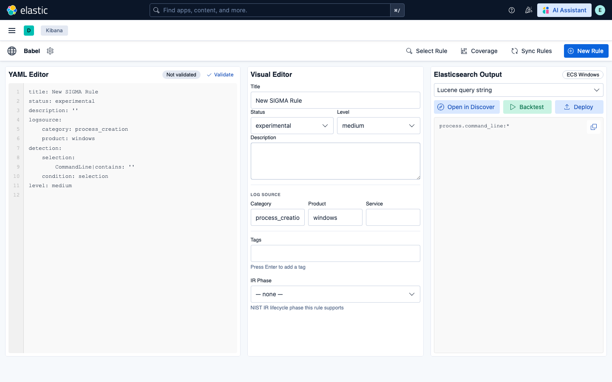
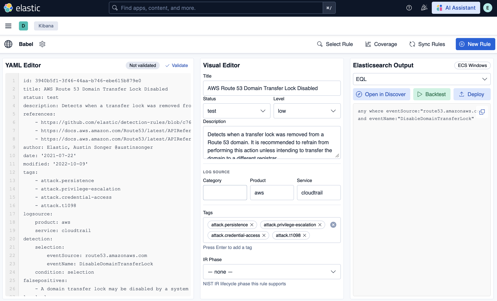
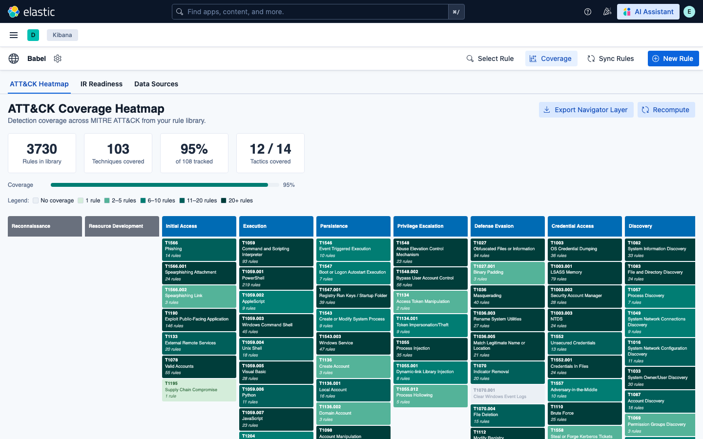
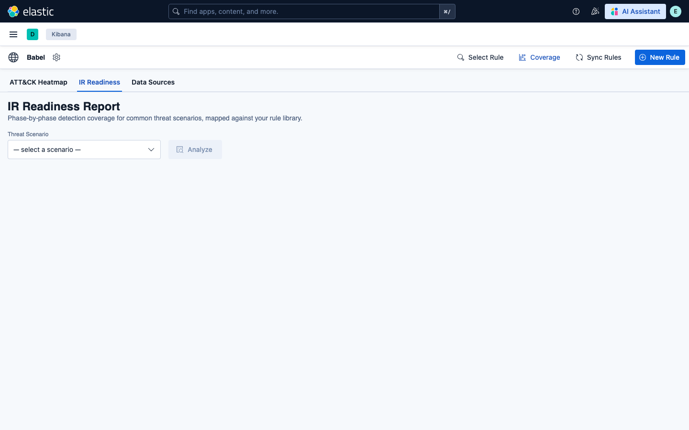
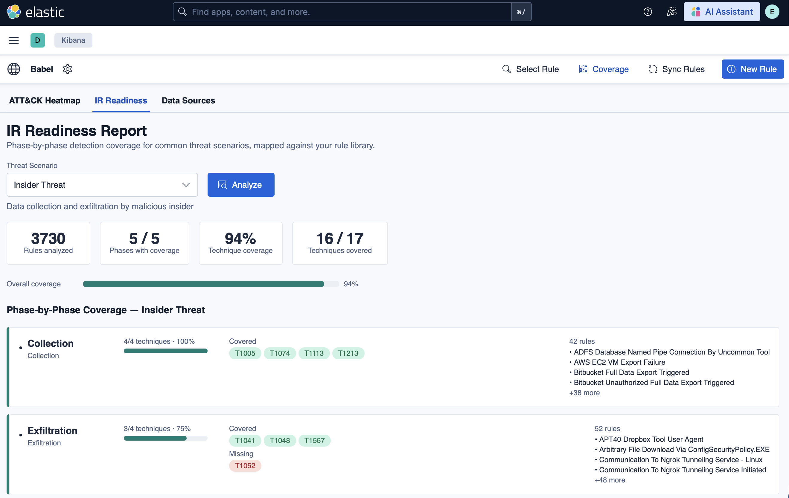
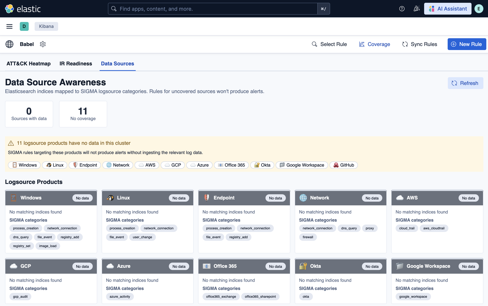
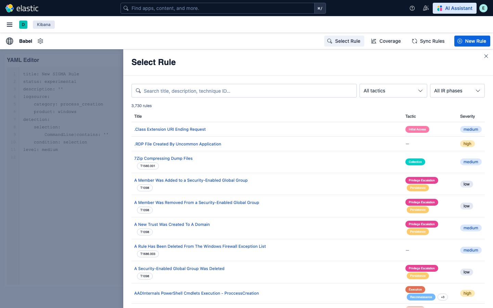
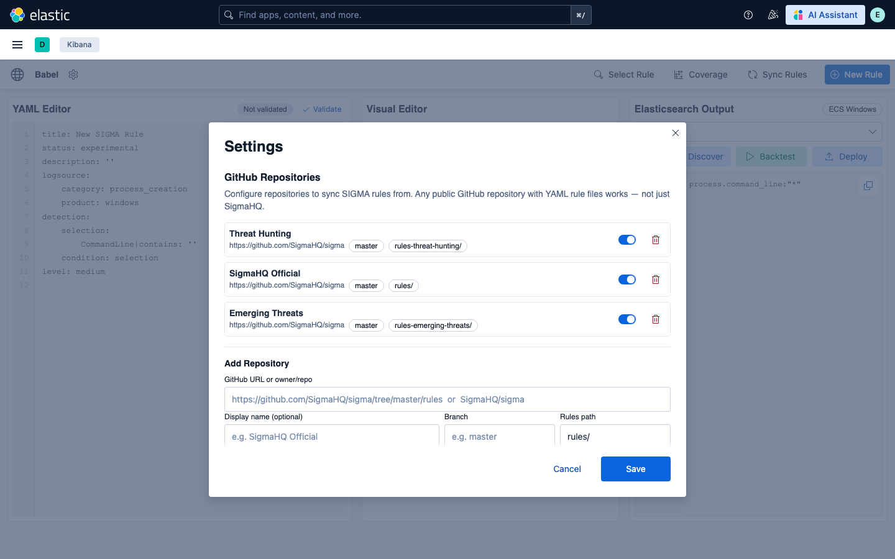
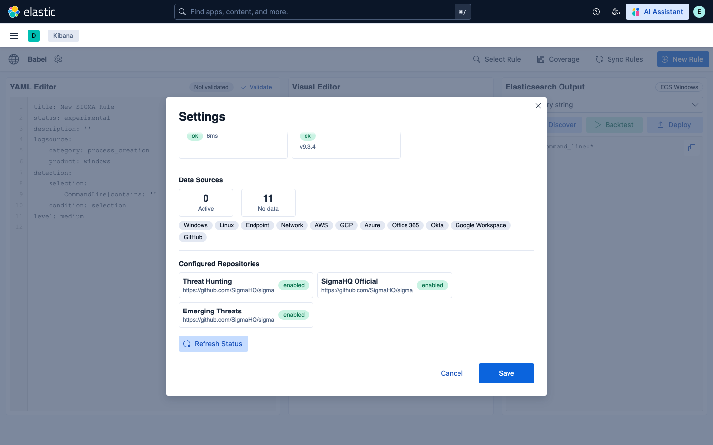

# Babel

Cybersecurity is a literal Babel — every platform speaks a different dialect, and detection rules written for one rarely run on another. Babel reverses the challenge: Built on the updated [SIGMA](https://sigmahq.io/) open standard and running natively inside modernized Elastic and Kibana, it lets security teams author, convert, test, deploy, and track detection rules across platforms and tools from a single interface aligned to the incident response lifecycle and tactics, techniques, and procedures.

> **Babel is a Kibana plugin — not a Fleet integration.**
> It cannot be installed from the Kibana Integrations page. Install it one of two ways:
> - **Docker Compose (recommended):** `docker-compose up --build -d` — the full stack starts automatically. See [Quick start](#quick-start-docker-compose).
> - **Manual install:** `bin/kibana-plugin install file:///path/to/babel-9.3.4.zip` — for existing Kibana deployments. See [Installing the pre-built zip](#distribution-installing-the-pre-built-zip).

## Screenshots

### Rule Editor
Write SIGMA rules in the YAML editor (left), see auto-populated fields in the Visual Editor (center), and get instant format conversion in the Elasticsearch Output panel (right). One-click **Open in Discover**, **Backtest**, and **Deploy** actions sit above the output.



### Real Rule — Full Metadata and EQL Conversion
Load any rule from the library to see its full SIGMA YAML, auto-populated Visual Editor fields (title, status, level, description, logsource, MITRE tags, IR phase), and live converted output. Here an AWS CloudTrail rule converts to EQL in one click.



### Multi-Format Conversion
Switch the output format from the dropdown — Lucene, EQL, ES|QL, Query DSL, Kibana NDJSON, SIEM Rule, or ElastAlert — and the converted query updates instantly.


### MITRE ATT&CK Coverage Heatmap
The Coverage view maps your rule library across all 14 ATT&CK tactics. Each cell shows technique coverage with a six-level color scale: no coverage → 1 rule → 2–5 → 6–10 → 11–20 → 20+ rules. Summary stats show total rules, techniques hit, and tactics covered.



### IR Readiness Report
The IR Readiness tab assesses detection coverage against five threat scenarios — ransomware, APT, insider threat, data breach, and supply chain. Select a scenario and click Analyze for a phase-by-phase breakdown.



Running the Insider Threat scenario shows 94% technique coverage across 5/5 phases, with covered and missing techniques listed per phase alongside the specific rules providing coverage.



### Data Source Awareness
The Data Sources tab maps your Elasticsearch indices against SIGMA logsource categories. Sources with no matching index data are flagged — rules targeting those sources won't produce alerts until the data is ingested.



### Rule Library
The Select Rule overlay searches all 3,730 synced rules by title, description, or technique ID. Filter by tactic or IR phase; click any row to load the rule directly into the editor.



### GitHub Repository Settings
Configure multiple GitHub repositories as rule sources — including separate paths within the same repo. Rules are synced per-repository with full isolation.



### Integration Status
The Settings panel shows live connectivity to the Babel API and Elasticsearch, available data source categories, and all configured repositories with their enabled state.



---

## Features

- **YAML editor** — write and validate SIGMA rules with real-time syntax feedback
- **Visual rule builder** — construct rules without writing raw YAML
- **Multi-SIEM conversion** — translate rules to 8 output formats:
  - Lucene query string
  - Query DSL
  - Kibana NDJSON
  - SIEM Rule (JSON / NDJSON)
  - EQL
  - ES|QL
  - ElastAlert
- **Live rule testing** — backtest against Elasticsearch indices with hit clustering
- **Rule deployment** — push rules directly to the Kibana Detection Engine
- **MITRE ATT&CK coverage heatmap** — visualize technique coverage across your rule set
- **IR readiness assessment** — map rules to incident response phases
- **Field suggestions** — auto-map SIGMA fields to ECS fields
- **Schema drift detection** — track changes to Elasticsearch mappings over time
- **Rule quality scoring** — assess rule effectiveness and staleness
- **Data source availability mapping** — inspect available indices, document counts, and field mappings
- **GitHub sync** — pull rules from multiple configurable GitHub repositories (SigmaHQ and custom repos); all rules synced with no cap

---

## Requirements

### Runtime

| Dependency | Version | Notes |
|---|---|---|
| Kibana / Elasticsearch | 9.3.4 | Pinned — see note below |
| Python | 3.11+ | Required by the Babel API |

### Build tools

| Dependency | Version | Notes |
|---|---|---|
| Node.js | 20+ | Build only |
| `zip` CLI | any | Build only |

### npm packages (runtime)

| Package | Version |
|---|---|
| `@elastic/eui` | ^114.3.0 |
| `js-yaml` | ^4.2.0 |
| `react` | ^18.3.1 |
| `react-dom` | ^18.3.1 |

### npm packages (dev / build)

| Package | Version |
|---|---|
| `typescript` | ^5.9.3 |
| `webpack` | ^5.107.2 |
| `webpack-cli` | ^6.0.1 |
| `ts-loader` | ^9.6.0 |
| `html-webpack-plugin` | ^5.6.7 |
| `jest` | ^30.4.2 |
| `jest-environment-jsdom` | ^30.4.1 |
| `ts-jest` | ^29.4.11 |
| `@testing-library/react` | ^16.3.2 |
| `@types/node` | ^20.19.42 |
| `@types/react` | ^18.3.31 |
| `@types/react-dom` | ^18.3.7 |
| `@types/jest` | ^30.0.0 |
| `@types/js-yaml` | ^4.0.9 |

### Python packages (Sigma conversion engine)

These are required by `server/translation_script/sigma/`. Set up a virtual environment before building or running the conversion script:

| Package | Version |
|---|---|
| `pySigma` | >=0.11.0, <1.0.0 |
| `pySigma-backend-elasticsearch` | >=1.0.0, <2.0.0 |

> **Important:** `kibanaVersion` in `kibana.json` is pinned to `9.3.4`. Kibana will refuse to load the plugin on a different version. If your target version differs, re-build with `KIBANA_VERSION=<your-version> npm run build` — the build script patches `kibana.json` automatically before packaging.

---

## Quick start (Docker Compose)

> **Prerequisites:** Docker and Docker Compose. Node.js 20+ is only needed if you are modifying the plugin source.

The full stack — Elasticsearch, Kibana (with Babel), and the Babel API — starts with a single command.

### 1. Configure credentials

```bash
cp .env.example .env
```

Edit `.env` and set at minimum:

| Variable | Purpose |
|---|---|
| `ELASTIC_PASSWORD` | Password for the `elastic` superuser |
| `KIBANA_SYSTEM_PASSWORD` | Internal Kibana service account password |
| `KIBANA_ENCRYPTION_KEY` | 32-character key for encrypted saved objects |

> **Note — existing Elasticsearch volume:** If you previously ran the stack with a different `ELASTIC_PASSWORD`, the stored password takes precedence over the environment variable. Reset it with: `docker exec babel-es bin/elasticsearch-reset-password -u elastic -b`

### 2. Build the Kibana plugin (one-time)

> **This step is required before the first `docker-compose up`.** Unlike most Docker Compose setups, the Kibana image cannot build the plugin at container startup — the plugin must be compiled locally first and is then copied into the image.

```bash
npm install
KIBANA_VERSION=9.3.4 npm run build
```

You only need to repeat this if you modify the plugin source. Normal restarts (`docker-compose up -d`) do not require a rebuild.

### 3. Start the stack

```bash
docker-compose up --build -d
```

This starts four services in dependency order:

| Service | Container | Port | Purpose |
|---|---|---|---|
| Elasticsearch | `babel-es` | 9200 | Rule storage and live rule testing |
| kibana-setup | *(exits after init)* | — | Sets the `kibana_system` account password once |
| Babel API | `babel-api` | 8001 | Rule conversion, validation, coverage, IR readiness |
| Kibana + Babel | `babel-kibana` | 5601 | UI |

First boot pulls images and installs Python dependencies (~2–3 min). Subsequent starts are fast.

### 4. Verify the stack is up

```bash
# Babel API
curl http://localhost:8001/health
# → {"status": "ok", "service": "sigma-api"}

# Kibana
curl -u elastic:<password> http://localhost:5601/api/babel/status
# → services: [{name: "Sigma Conversion API", status: "ok"}, {name: "Elasticsearch", status: "ok"}]
```

Kibana is available at **http://localhost:5601** — log in as `elastic` with the password from `.env`.

Navigate to **Babel** in the left sidebar. To check service connectivity, click the **gear icon (⚙)** in the Babel nav bar to open Settings — the bottom of the panel shows live status for the Babel API and Elasticsearch.

### 5. (First boot only) Sync rules from GitHub

The rule library (`babel_sigma_doc` index) is empty on first boot. In the Babel UI:

1. Go to **Settings** → add a GitHub repository (e.g. `https://github.com/SigmaHQ/sigma`, branch `master`, path `rules/`)
2. Click **Sync** — this fetches all SIGMA YAML files from the repo
3. Return to the **Rule Library** tab; rules will appear as the sync completes

> A GitHub Personal Access Token is strongly recommended for large repos like SigmaHQ (~3,000 rules). Without one, GitHub's 60 requests/hour unauthenticated limit will throttle the sync. Use a fine-grained PAT with **Contents: Read** permission only.

### Stopping and restarting

```bash
docker-compose down        # stop (data volumes preserved)
docker-compose down -v     # stop and wipe all data (fresh start)
docker-compose up -d       # restart without rebuilding images
docker-compose up --build -d  # rebuild images (after source changes)
```

---

## Architecture: the Babel API

Babel's conversion, validation, and analysis features are handled by a bundled **Babel API** — a Python Flask service built on [pySigma](https://github.com/SigmaHQ/pySigma) and the Elasticsearch backend. It runs as a separate container (`babel-api`) so the Kibana plugin stays pure JavaScript with no Python runtime dependency.

```
Kibana (Babel plugin)
    │ proxy requests
    ▼
Babel API  (babel-api:8001)          Elasticsearch  (babel-es:9200)
├─ POST /v1/conversions              ├─ babel_sigma_doc  (rule library)
├─ POST /v1/rules/validate           └─ babel_config     (settings)
├─ POST /v1/coverage
├─ POST /v1/coverage/navigator-export
├─ POST /v1/ir-readiness
├─ GET  /v1/fields[?category=…]
├─ POST /v1/fields/suggest
├─ POST /v1/rules/quality
└─ POST /v1/test-runs                ← also queries Elasticsearch
```

The Babel API source lives in `sigma-api/` and is built automatically by `docker-compose up --build`.

### What the API does

- Converts SIGMA YAML to Lucene, EQL, ES|QL, Kibana NDJSON, SIEM Rule, and ElastAlert
- Validates rule syntax and structure via pySigma
- Suggests ECS field mappings for logsource/detection fields
- Scores rule quality (title, description, references, tags, level, status)
- Maps rules to MITRE ATT&CK techniques for the coverage heatmap
- Assesses IR readiness across ransomware, APT, insider threat, data breach, and supply chain scenarios
- Runs live rule tests against Elasticsearch indices

### What degrades without the API

Features that call the Babel API will return errors if it is unreachable. Features that work without it:

| Feature | Requires API |
|---|---|
| Rule editor (YAML editing, saving) | No |
| Rule library (browse, search, sync from GitHub) | No |
| Rule conversion / translation | **Yes** |
| Rule validation | **Yes** |
| Rule deployment to Detection Engine | **Yes** (conversion step) |
| MITRE ATT&CK coverage heatmap | **Yes** |
| IR readiness assessment | **Yes** |
| Field mapping suggestions | **Yes** |
| Rule quality scoring | **Yes** |
| Live rule testing (backtest) | **Yes** |

### API authentication

Set `SIGMA_API_KEY` in `.env` to require a bearer token on all Babel API requests. Leave it empty (the default) for unauthenticated access within the Docker network.

---

## Installation

Babel is a **Kibana plugin**. It is not an Elastic integration and cannot be installed from the Kibana Integrations page (Fleet → Integrations). That page is for Elastic Agent data integrations, which use a different format entirely. Attempting to install Babel there will fail with a `manifest.yml not found` error.

There are two supported installation methods:

### Option A — Docker Compose (recommended)

The fastest way to get the full stack running. Elasticsearch, Kibana, and the Babel API all start together:

```bash
cp .env.example .env          # configure credentials
npm install && KIBANA_VERSION=9.3.4 npm run build   # one-time plugin build
docker-compose up --build -d  # start the stack
```

See [Quick start (Docker Compose)](#quick-start-docker-compose) for the full walkthrough.

### Option B — Manual install into an existing Kibana

If you already have Kibana running and want to add Babel to it:

```bash
# Kibana must be stopped during installation
bin/kibana-plugin install file:///absolute/path/to/babel-9.3.4.zip
```

Then configure `kibana.yml` (see [Configuration](#configuration)) and restart Kibana.

To uninstall:
```bash
bin/kibana-plugin remove babel
```

---

## Building from source

### 1. Install Node dependencies

```bash
npm install
```

### 2. Build

The build script auto-detects your Kibana version from a local install or a running Docker container named `kibana-local-dev`. If neither is present, set the version explicitly:

```bash
KIBANA_VERSION=9.3.4 npm run build
```

On success the script produces:
- `target/babel/` — assembled plugin directory
- `target/babel-<version>.zip` — distributable zip ready for `kibana-plugin install`

If the Docker container `kibana-local-dev` is running, the script also copies the plugin into the container and restarts Kibana automatically.

### 4. Manual install (no Docker)

```bash
cp -r target/babel/ /usr/share/kibana/plugins/babel
# Then restart Kibana
```

---

## Configuration

Add the following to `kibana.yml`:

```yaml
# URL of the Babel API — required, no default will work outside Docker
babel.sigmaApiUrl: "http://<sigma-api-host>:<port>/v1"

# URL Kibana uses to call itself when deploying detection rules
# Defaults to http://localhost:5601 for local testing — change if Kibana is behind a proxy or on a different host. Example is below:
babel.kibanaUrl: "http://localhost:5601"
```

### Environment variables (optional)

| Variable | Purpose |
|---|---|
| `SIGMA_API_KEY` | Bearer token forwarded to the Babel API if it requires authentication |

---

## Elasticsearch prerequisites

The plugin creates and uses two indices in your Elasticsearch cluster:

| Index | Purpose |
|---|---|
| `babel_sigma_doc` | Rule library synced from GitHub repositories |
| `babel_config` | Plugin settings (GitHub tokens, configured repos) |

Both indices are bootstrapped automatically on first run **when Kibana connects as a user with index-creation privileges**. Two cases require manual creation:

- `action.auto_create_index: false` is set on the cluster
- Kibana is configured to use the built-in `kibana_system` user (common with `elastic-start-local`), which does not have `indices:admin/create` permission

In either case, create the indices with the `elastic` superuser before starting Kibana:

```bash
curl -X PUT "http://localhost:9200/babel_config"
curl -X PUT "http://localhost:9200/babel_sigma_doc"
```

### GitHub rate limits

The rule sync feature fetches each YAML file individually from GitHub. Without a token, GitHub allows 60 unauthenticated requests per hour — not enough to sync large repos like SigmaHQ (~3,000 rules). **A GitHub Personal Access Token is strongly recommended.** Use a fine-grained PAT with only `Contents: Read` permission on the target repos. Store it in Settings → GitHub Token within the plugin.

### Authorization

All plugin API routes are accessible to any authenticated Kibana user. There is no per-route RBAC — a read-only analyst can deploy rules the same as an admin. Restrict access at the Kibana Space or network level if needed.

---

## Development

```bash
# Type-check without building
npm run typecheck

# Run tests (79 tests across server + public)
npm test

# Full build
KIBANA_VERSION=9.3.4 npm run build
```

### Project structure

```
public/
  components/     React UI components
  hooks/          Custom hooks (editor sync, auto pipeline selection)
  services/       API client
  context/        Kibana service provider
server/
  routes/         Kibana server-side API routes
  translation_script/sigma/   Python SIGMA conversion engine (pySigma)
  plugin.ts       Kibana plugin lifecycle
  config.ts       Plugin configuration schema
scripts/
  build.js        Build orchestrator (typecheck → compile → webpack → zip)
.github/
  workflows/ci.yml   CI: typecheck, test, build, upload zip artifact
```

---

## License

Licensed under the [Apache License 2.0](LICENSE). Free to use, modify, and distribute — including in commercial and enterprise environments — without obligation to open source your modifications.
